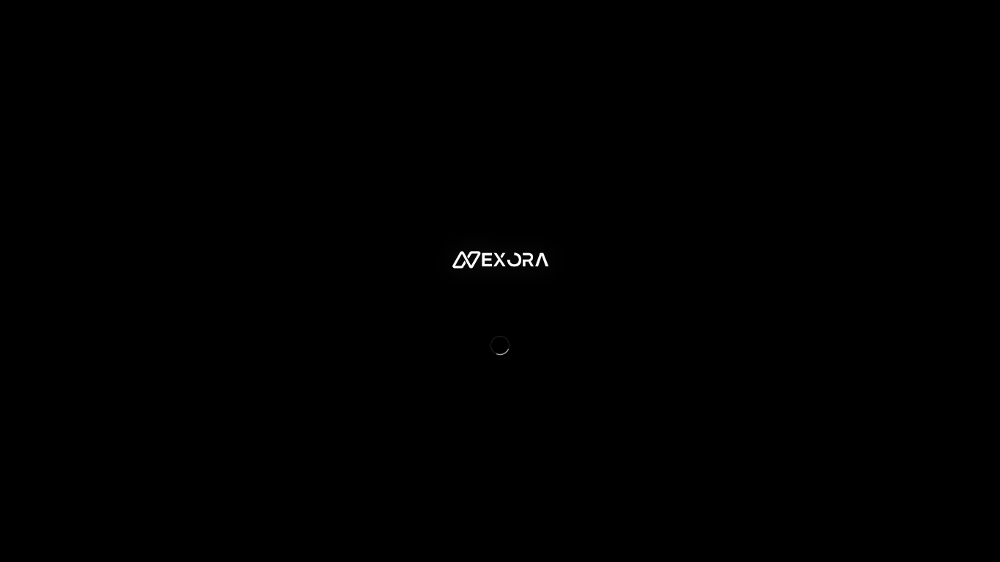
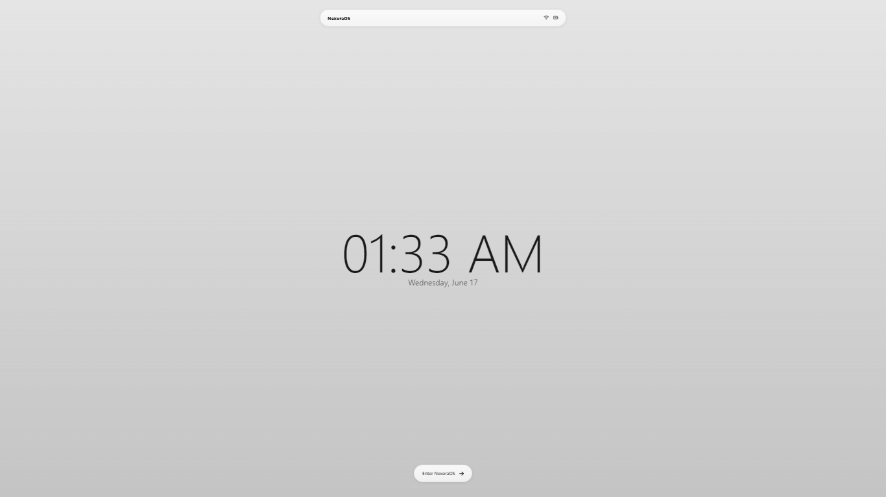
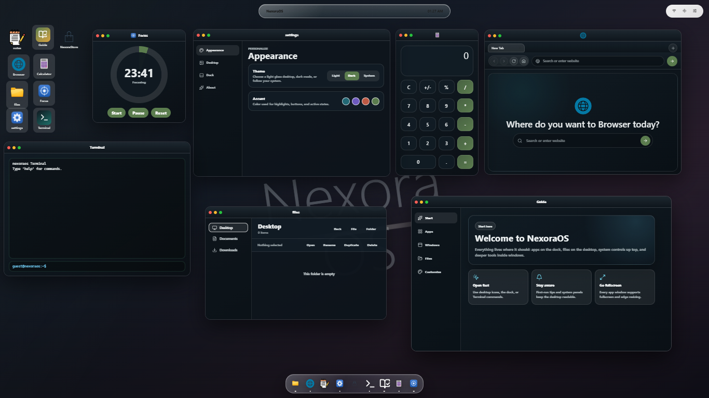
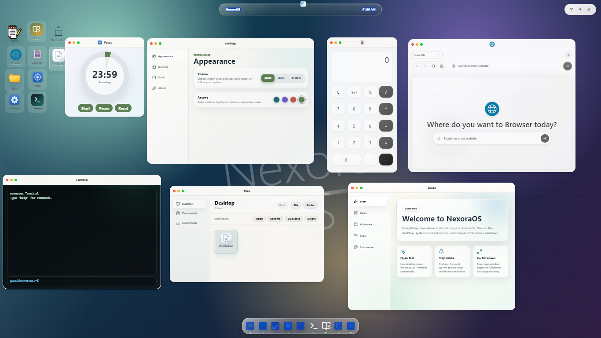

# 🖥️ NexoraOS

A futuristic operating system-inspired portfolio website that transforms a traditional portfolio into an interactive desktop experience. Built to showcase my projects, skills, achievements, and journey in Data Science, Machine Learning, AI, and Web Development through a modern and immersive user interface.







---

## 📖 Overview

NexoraOS reimagines the concept of a personal portfolio as a desktop operating system. Visitors can navigate through applications, explore projects, view technical skills, and learn more about my experience through an intuitive and visually appealing interface.

---

## ✨ Features

- 🖥️ Operating system-inspired interface
- 📱 Fully responsive design
- ⚡ Smooth animations and interactions
- 📂 Interactive desktop icons
- 📈 Professional timeline section
- 🛠️ Skills dashboard
- 📁 Project showcase
- 📬 Contact section
- 🎨 Custom-designed UI assets
- 🌙 Modern dark theme

---

## 🛠️ Tech Stack

### Frontend

- HTML5
- CSS3
- JavaScript

### Design & Assets

- Custom Icons
- SVG Graphics
- Responsive Layouts

---

## 📂 Project Structure

```text
NexoraOS/
│
├── index.html
├── styles.css
├── app.js
├── README.md
│
└── assets/
    │
    ├── Nexora assets/
    │   ├── app_icon.png
    │   ├── Horizontal.png
    │   ├── Vertical.png
    │   ├── Browser.png
    │   ├── calculator.png
    │   ├── file-explorer.png
    │   ├── folder.png
    │   ├── notes.png
    │   ├── settings.png
    │   ├── weather.png
    │   ├── txt.png
    │   ├── background1.jpeg
    │   ├── background2.jpg
    │   ├── blank.png
    │   ├── vibesstore.png
    │   └── focus.png
    │
    ├── cursor-pointer.svg
    └── windows.svg
```

---

## 🚀 Getting Started

### Prerequisites

You only need a modern web browser:

- Google Chrome
- Microsoft Edge
- Mozilla Firefox
- Safari

---

## 📥 Installation

Clone the repository:

```bash
git clone https://github.com/your-username/NexoraOS.git
```

Navigate to the project directory:

```bash
cd NexoraOS
```

---

## ▶️ Running the Project

### Option 1: Open Directly

Open the `index.html` file in your browser.

### Option 2: Using VS Code Live Server

1. Install the Live Server extension.
2. Open the project in VS Code.
3. Right-click `index.html`.
4. Select **Open with Live Server**.

---

## 🎯 Purpose

This project was created to:

- Present technical skills in a unique way
- Showcase projects through an engaging experience
- Demonstrate frontend development abilities
- Build a memorable portfolio for recruiters and collaborators
- Combine creativity with usability

---

## 🖼️ Custom Assets

NexoraOS includes a collection of custom-designed operating system assets, such as:

- Application icons
- File explorer graphics
- Settings and utility icons
- Wallpapers and backgrounds
- Custom cursor assets
- Desktop interface elements

These assets help create a cohesive operating system experience throughout the website.

---

## 🔮 Future Improvements

Planned features include:

- Window management system
- Draggable applications
- Interactive terminal
- Theme customization
- Progressive Web App (PWA) support
- AI-powered assistant
- Additional desktop applications

---

## 🤝 Contributing

Contributions, ideas, and suggestions are welcome.

1. Fork the repository
2. Create a feature branch

```bash
git checkout -b feature-name
```

3. Commit your changes

```bash
git commit -m "Add feature"
```

4. Push to GitHub

```bash
git push origin feature-name
```

5. Open a Pull Request

---

## 👨‍💻 Authors

### Bassel Mohammed & Ammar Yasser 

---

## ⭐ Support

If you found this project interesting, consider giving it a star. It helps others discover the project and supports future development.

---

## 📄 License

This project is licensed under the MIT License.